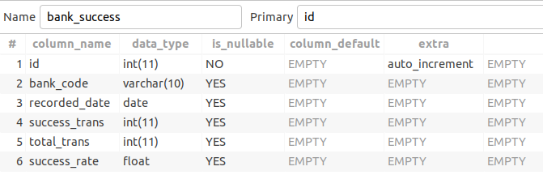

Linux, Tooling, Database & Deployment

# Bash Script

- I have learnt what is a shell, scripting and **Bash**, I also configure my Ubuntu to run on `ZSH` and apply `powerlevel10k` theme which is professional and nice.
- I also learnt:
  - Write a simple script, grant permisson to run script naturally
  - Relative and absolute paths
  - Create variables, perform input/output/error redirections
  - Create functions
  - Numeric and String Comparisons
  - Conditional Statements
  - Positional parameters
  - Loops

# Docker

Here is some of my commands for this module:

- `docker run -p 3306:3306 --name phuc-hung-mysql -e MYSQL_ROOT_PASSWORD=admin -d mysql:5.7`: for pulling and running mysql:5.7 and setting password for root user
- `docker run -p 8080:8080 -d -v ~/Desktop/internship/module-2-linux-database-deployments/airflow/dags/:/usr/local/airflow/dags puckel/docker-airflow webserver`: for pulling and running airflow and mapping `dags folder` to host machine
- `docker run -p 8529:8529 -e ARANGO_ROOT_PASSWORD=ngph arangodb/arangodb:3.6.5`: for pulling and running and setting password for `arangodb`
- `docker inspect <container_id> | grep "IPAddress"`: for connecting Airflow to MySQL
- `docker exec -i <container_name></container_name> mysql -uroot -pngph m2 < m2.sql`: for inserting .sql file to mysql container

# Databases
- At first, I tried installing `MySQL, MongoDB and ArangoDB` on the system. Then, I learnt how to use `Docker` to pull images and run them on container for more convenience
- In my exercies for this module, the following tables are the schemas for the first three requirements

In our exercies, I have created 6 tables:
- `bank`: for storing `bank_code`
- `user`: for storing `user_id`
- `transaction`: storing all original fields in csv file.
- `bank_success`: for storing `recorded_date, success_trans, total_trans, success_rate` for each `bank_code`
- `user_rfm`: for storing `recorded_date, recency, frequency, monetary, r_score, f_score, m_score and rfm_score` for each `user_id`
- `user_pay_app`: for storing `app_id, total_amount` for each `user_id`

  
   
  <i>Bank table schema</i>

  
   
  <i>User table schema</i>

  
   
  <i>Transaction table schema</i>

  
   
  <i>Bank Success table schema</i>

  
   
  <i>User RFM table schema</i>

  
   
  <i>User Pay App table schema</i>

Here is my results:

  
   
  <i>Bank table</i>

  
   
  <i>User table</i>

  
   
  <i>Transaction table</i>

  
   
  <i>Bank Success table</i>

  
   
  <i>User RFM table</i>

  
   
  <i>User Pay App table</i>

- For the task of conduting transfer relationships between users, I tried to create documents, edges and graph on `ArangoDB` but still doesn't have enough time to learn how to query `Graph Database`. Here is my result:

  
   
  <i>Users Document</i>

  
   
  <i>Send To Edges</i>

  
   
  <i>Graph</i>

# Scheduling

- I have been able to schedule for calculating `bank_success_rate` for each day from `2018-12-01` to `2018-12-31` and successfully inserting results into MySQL. Here is my schedule result:

  
   
  <i>Airflow - Schedule bank_success_rate</i>

# Comparing Airflow vs Crontab

**Problems with crontab**
- `Failures`: cannot retry on failures (how many times? how often?)
- `Monitoring`: cannot detect success/fail status of a task/ how long a process run?
- `Dependencies`: 
  - Data dependencies: Upstream data is missing
  - Execution dependecies: job 2 runs after job 1 is finished
- `Scalability`: no centrailized scheduler between different cron machines
- `Deployment`: cannot adapt to new changes constantly
- `Process historic data`: cannot backfill/rerun historical data

**Airflow offers**: a workflow (data-pipeline) management system developed by `Airbnb`:
- A framework to define tasks & dependencies in `Python`
- Executing, scheduling, distributing tasks across worker nodes
- View of present and past runs, logging feature
- Extensible through plugins
- Nice UI, possibility to define `REST` interface
- Interact well with database

