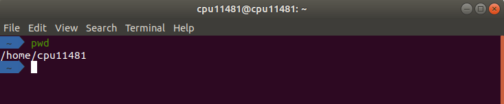
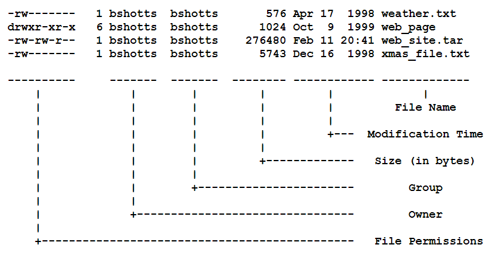

Linux Programming

- [Definition](#definition)
  - [Linux](#linux)
  - [Shell](#shell)
  - [Terminal](#terminal)
- [Learning the Shell](#learning-the-shell)
  - [Navigation](#navigation)
  - [Looking around](#looking-around)
  - [Manipulating Files](#manipulating-files)
  - [I/O Direction](#io-direction)

# Definition

## Linux

    An operaing system which is most used and most important on the planet.

- It powers web, infracstructure, largest supercomputers, ...
- Developing for Linux can be a bit of a challenge, but it can also be extremely rewarding

## Shell

    A program that takes commands from the keyboard and gives them to the operating system to perform

- On most Linux system, a program called [bash](https://en.wikipedia.org/wiki/Bash_(Unix_shell)) (Bourne Again SHell)
- Besides, others include: `ksh,tcsh` and `zsh` 

## Terminal

    A program that opens a window and lets you interact with the shell

- Most Linux distros supply several: `gnome-terminal, konsole, xterm, rxvt, kvt, nxterm, eterm`

# Learning the Shell

## Navigation

**File System Organization**

  
   
  <i><a href=https://thesagediary.com/2020/04/14/linux-file-system-directory-architecture/>Source: Linux File System Directory Architecture</a></i>

    In Linux, the files are arranged in hierarchical directory structure

- In other words, they are organized in a `tree-like pattern of directories`
- The first directory is called `root directory`, which contains files and subdirectories and so on.
- Linux doesn't employee the concept of drive letters (which splits file system into a series of different trees)
- Different storage devices may contain different branches of the tree, however, Linux always has <mark>a single tree</mark>

**pwd**

    Find current working directory

- At any moment, you are located in a single directory
- Inside that directory, you can see its files and the pathway to its `parent directory` and the pathway to the `subdirectories` in which you are standing
- When you first log on to a Linux system, the working directory 

**cd**

    Change working directory

- Type `cd` followed by the `pathname` of the desired working directory

- `pathname` can be specified in one of two different ways
  
  - `absolute pathnames`: begins with the root directory and follows the tree branch by branch until the path to the desired directory or file is completed
  - `relative pathnames`: starts from working directory. To do this, it uses a couple of special notations to represent relative positions in the file system tree
    - "." notation refers to the working directory itself
    - ".." notation refers to the working directory's parent directory

- Shortcuts
  
  - `cd followed by nothing`: change directory to your home directory.
  - `cd ~user_name`: change working directory to home directory of specified user.
  - `cd -`: change working directory to previous one.

## Looking around

**ls**

    List the contents of a directory

| Command         | Results                                                       |
| --------------- | ------------------------------------------------------------- |
| ls              | List the files in pwd                                         |
| ls /Desktop     | List the files in the /Desktop directory                      |
| ls -l           | List files in pwd in long format                              |
| ls -l /etc /bin | List files in /bin and /etc directories in long format        |
| ls -la          | List files (even ones beginning with a period - hidden files) |

**Long format**

| Name              | Meaning                                                                                                                                                                                                                                                                                                                                                                          |
| ----------------- | -------------------------------------------------------------------------------------------------------------------------------------------------------------------------------------------------------------------------------------------------------------------------------------------------------------------------------------------------------------------------------- |
| FIle Name         | Name of file/directory                                                                                                                                                                                                                                                                                                                                                           |
| Modification Time | The last time the file was modified                                                                                                                                                                                                                                                                                                                                              |
| Size              | SIze of file in bytes                                                                                                                                                                                                                                                                                                                                                            |
| Group             | Name of group that has file permissions                                                                                                                                                                                                                                                                                                                                          |
| Owener            | Name of user who owns the file                                                                                                                                                                                                                                                                                                                                                   |
| File permisson    | File's access permissions. The first character is the type of file. A "-" indicates a regular (ordinary) file. A "d" indicates a directory. The second set of three characters represent the read, write, and execution rights of the file's owner. The next three represent the rights of the file's group, and the final three represent the rights granted to everybody else. |

**less**

 A program lets you view text files

- **Command**: `less text_file`

**file**

As you wander around Linux system. It's helpful to determine what kind of data a file contains before you try to view it.

- **Command**: `file name_of_file`

## Manipulating Files

**Wildcards**

| Wildcard      | Meaning                                                                                                                    |
|---------------|----------------------------------------------------------------------------------------------------------------------------|
| *             | Matches any characters                                                                                                     |
| ?             | Matches any single character                                                                                               |
| [characters]  | Matches any character that is a member of the set characters [:alnum:] \| [:alpha:] \| [:digit:] \| [:upper:] \| [:lower:] |
| [!characters] | Matches any character that is not a member of the set characters                                                           |

**cp**

    Copy files and directories

- Copies a single file: `cp file1 file2`
- Copies multiple files: `cp file... directory`

| Command           | Results                                                                                                                                                       |
|-------------------|---------------------------------------------------------------------------------------------------------------------------------------------------------------|
| `cp file1 file2`    | If file2 does not exist, it is created; otherwise, file2 is silently overwritten with the contents of file1.         |
| `cp -i file1 file2` | if file2 exists, the user is prompted before it is overwritten with the contents of file1.                                                                    |
| `cp file1 dir1`     | Copy the contents of file1 (into a file named file1) inside of directory dir1.                                                                                |
| `cp -R dir1 dir2`   | Copy the contents of the directory dir1. If directory dir2 does not exist, it is created. Otherwise, it creates a directory named dir1 within directory dir2. |

**mv**
    
    Moves or renames files and directories

- To rename: `mv filename1 filename2`
- To move files to different directory: `mv file... directory`

| Command                   | Results                                                                                                                               |
|---------------------------|---------------------------------------------------------------------------------------------------------------------------------------|
| `mv file1 file2`         | If file2 does not exist, then file1 is renamed file2. If file2 exists, its contents are silently replaced with the contents of file1. |
| `mv -i file1 file2`         | Ff file2 exists, the user is prompted before it is overwritten with the contents of file1.                                            |
| `mv file1 file2 file3 dir1` | The files file1, file2, file3 are moved to directory dir1. If dir1 does not exist, mv will exit with an error.                        |
| `mv dir1 dir2`              | If dir2 does not exist, then dir1 is renamed dir2. If dir2 exists, the directory dir1 is moved within directory dir2.                 |

**rm**

    Removes files and directories

- Files: `rm file...`
- Direcoties: `rm -r directory...`

| Command           | Results                                                                 |
|-------------------|-------------------------------------------------------------------------|
| `rm file1 file2`    | Delete file1 and file2.                                                 |
| `rm -i file1 file2` | The user is prompted before each file is deleted.                       |
| `rm -r dir1 dir2`   | Directories dir1 and dir2 are deleted along with all of their contents. |

**mkdir**

    Create directories

- Command: `mkdir directory...`
  

## I/O Direction

**Standard Output**

    To redirect standard output to a file

- `>` - to redirect standard output to a file (overwritten if exists)
- '>>' - to append to a file

**Standard Input**

    To redirect standard input from a file

- `<` - to get contents of file for processing
- `< ... >`- to get contents of file for processing and pass the results to a fle

**Pipelines**

    Connect multiple commands together. The standard output of one command is fed into the standard input of another

- Command: `|`
- Example: `ls -l | less`

**Filters**

    Take standard input and perform an operation on it and send the results to standard ouput

