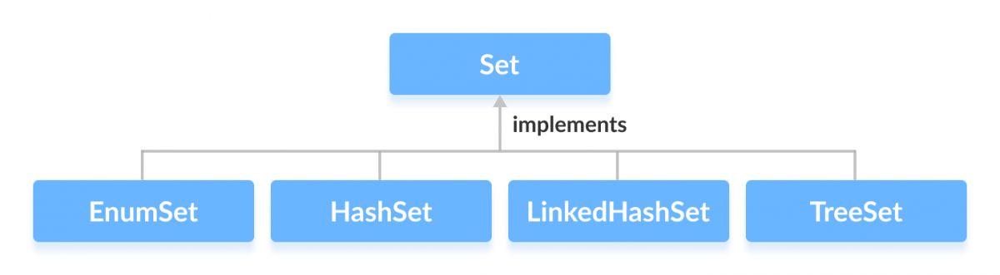

<p style="font-size:30px;text-align:center;font-weight:bold;">Java Application</p>

- [Java Programming Language](#java-programming-language)
  - [What is Java?](#what-is-java)
  - [*Write once, run everywhere*](#write-once-run-everywhere)
  - [JDK, JRE and JVM](#jdk-jre-and-jvm)
    - [JVM (Java Virtual Machine)](#jvm-java-virtual-machine)
    - [JRE (Java Runtime Environment)](#jre-java-runtime-environment)
    - [JDK (Java Development Kit)](#jdk-java-development-kit)
  - [Java Compile and Run Process](#java-compile-and-run-process)
  - [Java Data Types](#java-data-types)
    - [Primitive types](#primitive-types)
    - [Non-primitives data type](#non-primitives-data-type)
  - [Java is Pass-by-Value](#java-is-pass-by-value)
  - [Exceptions](#exceptions)
    - [Error](#error)
    - [Exceptions](#exceptions-1)
    - [RuntimeException - unchecked exception](#runtimeexception---unchecked-exception)
    - [IOException - checked exception](#ioexception---checked-exception)
  - [Abstract vs Interface](#abstract-vs-interface)
    - [Interface](#interface)
    - [Abstract](#abstract)
    - [Comparision](#comparision)
    - [When to use which](#when-to-use-which)
  - [Java Collections](#java-collections)
    - [List](#list)
    - [Set](#set)
    - [Map](#map)
  - [Java Generics](#java-generics)
    - [How to use](#how-to-use)
    - [Creating Generic Class](#creating-generic-class)
    - [Creating Generics Methods](#creating-generics-methods)
    - [Bounded types](#bounded-types)
    - [Advantages](#advantages)
  - [Multithreading](#multithreading)
    - [Basic Multithreading](#basic-multithreading)
      - [Concurrency](#concurrency)
      - [Parallelism](#parallelism)
      - [Multithreading in Java is both Concurrency and Parallelism](#multithreading-in-java-is-both-concurrency-and-parallelism)
      - [Runnable vs Thread](#runnable-vs-thread)
    - [Advanced Multithreading](#advanced-multithreading)
      - [Thread safety](#thread-safety)
      - [Thread Pools](#thread-pools)
  - [Java 8 LTS](#java-8-lts)
    - [Lambda Expressions](#lambda-expressions)
      - [Functional Interface](#functional-interface)
      - [Defnition](#defnition)
      - [Usage](#usage)
      - [Types](#types)
    - [Default methods](#default-methods)
    - [Stream](#stream)
      - [Definition](#definition)
      - [Operations](#operations)
    - [Optional class](#optional-class)
    - [New DateTime API](#new-datetime-api)
      - [LocalDate](#localdate)
      - [LocalTime](#localtime)
      - [LocalDateTime](#localdatetime)
      - [ZonedDateTime](#zoneddatetime)
      - [Period](#period)
      - [Duration](#duration)
      - [Compatibility with Date and Calendar](#compatibility-with-date-and-calendar)
      - [Formatting](#formatting)
  - [Maven](#maven)
    - [Definition](#definition-1)
    - [Commands](#commands)
  - [Unit Test](#unit-test)

# Java Programming Language

## What is Java?
- A object oriented programming language (OOP) based on class.
- Instead of compiling source code to machine code when running, Java compiles source code to bytecode, bytecode will be executed by runtime environment.
- Java is **free to access** and **run on all platforms**
- Java is highly popular and has many applications in many fields:
  - **Banking**: To deal with transaction management.
  - **Retail**: Billing applications that you see in a store/restaurant are completely written in Java.
  - **Information Technology**: Java is designed to solve implementation dependencies.
  - **Android**: Applications are either written in Java or use Java API.
  - **Financial services**: It is used in server-side applications.
  - **Stock market**: To write algorithms as to which company they should invest in.  
  - **Big Data**: Hadoop MapReduce framework is written using Java.

<p align="center">
  
  <br/>
  <i><a href=https://www.edureka.co/blog/what-is-java/>Source: What Is Java? A Beginner’s Guide to Java and Its Evolution</a></i>
</p>

## *Write once, run everywhere*

    A programmer can develop Java code on one system and can expect it to run on any other Java-enabled system without adjustment.

- In traditional programming language like C or C++, source code is converted to code suitable for particular hardware. Hence, when we try to run same code on another machine with different hardware, error will happen or we have to recompile code.
- In Java, the program is not converted directly to machine code, but to bytecode(.class file), which is interpreted by JVM. Hence, it can be run on any machine which has JVM.

<p align="center">
  
  <br/>
  <i><a href="https://www.geeksforgeeks.org/why-is-java-write-once-and-run-anywhere/">Source: Why is Java ‘write once and run anywhere’?</a></i>
</p>

## JDK, JRE and JVM
### JVM (Java Virtual Machine)

    Convert bytecodes to machine code

When you run the Java program, Java compiler first compiles your Java code to bytecode. Then, the JVM translates bytecode into native machine code (set of instructions that a computer's CPU executes directly).


<p align="center">
  
  <br/>
  <i><a href="https://www.programiz.com/java-programming/jvm-jre-jdk">Source: Java JDK, JRE and JVM</a></i>
</p>

### JRE (Java Runtime Environment)

    Provide Java class libraries

A superset of JVM

<p align="center">
  
  <br/>
  <i><a href="https://www.programiz.com/java-programming/jvm-jre-jdk">Source: Java JDK, JRE and JVM</a></i>
</p>

### JDK (Java Development Kit)

    Development kit required to develop applications in Java
Contains a number of development tools(compilers, JavaDoc, Java Debugger, etc..)
<p align="center">
  
  <br/>
  <i><a href="https://www.programiz.com/java-programming/jvm-jre-jdk">Source: Java JDK, JRE and JVM</a></i>
</p>

<p align="center">
  
  <br/>
  <i><a href="https://www.programiz.com/java-programming/jvm-jre-jdk">Source: Java JDK, JRE and JVM</a></i>
</p>

## Java Compile and Run Process

<p align="center">
  
  <br/>
  <i><a href="https://javatutorial.net/jvm-explained">Source: JVM Explained</a></i>
</p>

**Loading**
- Compiled classes (.class) is loaded into memory
- Classes are introduced into Java environment when they are referenced by name in a class that is already running.
- Loading classes is done by class loader, once the first class is running.

**Linking**

Verifying and preparing class/interface, its direct superclass, its direct superinterfaces and its element type if needed

**Initialization**

- Executing its class/interface initialization method or calling the class's constructor
- All static variables will be assigned with original values, the static block will be executed

**Method Area**

- All class level data will be stored here (including static variables)
- Only one method area per JVM, it is a shared resource

**Heap Area**
- All objects and their variables, arrays will be stored here
- Only one heap area per JVM, and it is a shared resources

**Stack Area**

- For every thread, a seperate stack will be created. For every method call, one entry will be made in the stack memory (Stack Frame)
- Local variables in stack memory
- Not a shared resources

**PC Registers**

- Each thread will have seperate PC Registers for holding address of current executing
- Once the instruction is executed, PC register will be updated with next instruction

**Native Method stacks**
- Holds native method information

**Interpreter**
- Converts bytecodes into machine code
- Slow when one method is called multiple times

**JIT Compiler**

Takes advantage of `Interpreter`, make sure multiple interpreation doesn't occur to same code

**Garbage Collector**

Collects and removes unreferenced objects.

**Java Native Interface**

Interacts with Native Method libraries and provides Native Libraries required for Execution Engine

**Native Method Libraries**

Collection of Native Libraries required for Execution Engine

## Java Data Types

### Primitive types

**boolean**
- Two possible values: `true` or `false`
- Default: `false`
- Declaration: `boolean flag = true;`

**byte**
- Value from: `[-127, 128]`
- It's used instead of `int` or other integer data types to save memory when it's certain that value of a variable will be within `[-128,127]`
- Default: `0`
- Declaration: `byte range = 124;`

**short**
- Value from: `[-32768, 32767]`
- It's used instead of `int` or other integer data types to save memory when it's certain that value of a variable will be within `[-32768, 32767]`
- Default: `0`
- Declaration: `short temp = -200;`

**int**
- Value from: [-2<sup>31</sup>, 2<sup>31</sup>-1]
- `unsigned 32-bit integer`: [0, 2<sup>32</sup>-1]
- Default: `0`
- Declaration: `int range = -4250000;`

**long**
- Value from: [-2<sup>63</sup>, 2<ssup>63</ssup>-1]
- `unsigned 64-bit integer`: [0, 2<sup>64</sup>-1]
- Default: `0`
- Declaration: `long range = -42332200000L;`

**double**
- Double-precision `64-bit floating-point`
- Should not be used for precise values such as currency
- Default: `0.0`
- Declaration: `double range = -42.3;`

**float**
- Single-precision `32-bit floating-point`
- Should not be used for precise values such as currency
- Default: `0.0`
- Declaration: `float range = -42.3f;`

**char**
- `16-bit unicode character`
- Default: `\u0000`
- Declaration: `char letter = '\u0051';`

### Non-primitives data type

- Called **referenced types** because they refer to objects
- Are created by programmer and is not defined by Java (except for `String`)
- Can be used to call methods
- Can be null
- Starts with uppercase letter
- All have same sizes

## Java is Pass-by-Value

- **Pass by Value:** The method parameter values are copied to another variable and then the copied object is passed
- **Pass by Reference:** An alias or reference to the actual parameter is passed to the method

To test whether Java (or anything language) if it's passed by value, we use swap method
```
public static void swap(Object o1, Object o2){ //o1=50, o2=100
	Object temp = o1; //temp=50, o1=50, o2=100
	o1=o2; //temp=50, o1=100, o2=100
	o2=temp; //temp=50, o1=100, o2=50
} //method terminated
```

Assume that we have 2 objects, o1 and o2 with address 50 and 100 respectively. After swap terminated, we noticed changing values of o1 and o2 but they are copies of two real objects. Hence, there is actually no change in the values of 2 objects.

## Exceptions

<p align="center">
  
  <br/>
  <i><a href="https://www.programiz.com/java-programming/exceptions">Source: Exceptions</a></i>
</p>

### Error

- Irrecoverable exceptions such as out of memoery, memory leaks, stack overflow errors, library incompartibility, infinite recursion, etc.
- Beyond the control of programmer, we should not try to handle errors

### Exceptions

- Can be caught and handled by the program
- When exception happens, it creates an object (exception object). It contains information about exeption such as the name, description and state of program when exception occurred

### RuntimeException - unchecked exception

    Exception that is not checked at compile time
- Commons
  - `IllegalArgumentException`: Improper use of an API
  - `NullPointerException`: Null pointer access (missing the initialization of vairable)
  - `ArrayIndexOutOfBoundsException`: Out-of-bounds array access
  - `ArithmeticException`: dividing a number by 0

### IOException - checked exception
    Checked by compiler at compile-time and programmer is prompted to handle these exceptions
- Commons
  - `FileNotFoundException`: Try to open non-exists file
  - Try to read past the end of a file

## Abstract vs Interface

### Interface

- Not a class
- Only contains empty methods
- A blueprint for classes to implement
- A class can implement many interfaces
- Class must implement all methods in interface

### Abstract

- Same same as interface but contains more
- Two types of methods:
  - abstract method - empty method
  - normal method
- A class can only extend one abstract class
- Normal method will be used for all sub class (without reimplementing)

### Comparision

- **Abstract**:
  - Cannot extend many abstract class
- **Interface**
  - When a class implements an interface, that class needs to implement all methods (some of them may not be needed)

### When to use which
- **Abstract**: use when extended class have lots of properties in common with abstract class
- **Interface**: use when we want a function be used among classes without caring what it is

## Java Collections

<p align="center">
  
  <br/>
  <i><a href="https://www.programiz.com/java-programming/collections">Source: Collections</a></i>
</p>

### List 

    An ordered collection that allows to add and remove elements like an array

<p align="center">
  
  <br/>
  <i><a href="https://www.programiz.com/java-programming/list">Source: List</a></i>
</p>

- **ArrayList**: allows us to create resizable-arrays.
- **LinkedList**: provides the functionality of the linked list data structure.
- **Vector**: provides the functionality of the linked list data structure.
- **Stack**: provides the functionality of the linked list data structure.

**How to use**

In Java, we must import java.util.List package in order to use List.

```
// ArrayList implementation of List
List<String> list1 = new ArrayList<>();

// LinkedList implementation of List
List<String> list2 = new LinkedList<>();
```

**Methods**

- `add()` - adds an element to a list
- `addAll()` - adds all elements of one list to another
- `get()` - helps to randomly access elements from lists
- `iterator()` - returns iterator object that can be used to sequentially access elements of lists
- `set()` - changes elements of lists
remove() - removes an element from the list
- `removeAll()` - removes all the elements from the list
- `clear()` - removes all the elements from the list (more efficient than removeAll())
- `size()` - returns the length of lists
- `toArray()` - converts a list into an array
- `contains()` - returns true if a list contains specified element

### Set

**Classes that implement Set**

<p align="center">
  
  <br/>
  <i><a href="https://www.programiz.com/java-programming/set">Source: Set</a></i>
</p>

- **HashSet**: provices the functionalities for hash table data structure
- **LinkedHashSet**: provides functionalities of both the hashtable and the linked list data structure
- **EnumSet**: provides a set implementation of elements of a single enum.
- **TreeSet**: provides the functionality of a tree data structure.

**How to use**

In Java, we must import java.util.Set package in order to use Set.
```
// Set implementation using HashSet
Set<String> animals = new HashSet<>();
```

**Methods**

- `add()` - adds the specified element to the set
- `addAll()` - adds all the elements of the specified collection to the set
iterator() - returns an iterator that can be used to access elements of the set sequentially
- `remove()` - removes the specified element from the set
- `removeAll()` - removes all the elements from the set that is present in another specified set
- `retainAll()` - retains all the elements in the set that are also present in another specified set
- `clear()` - removes all the elements from the set
- `size()` - returns the length (number of elements) of the set
- `toArray()` - returns an array containing all the elements of the set
- `contains()` - returns true if the set contains the specified element
- `containsAll()` - returns true if the set contains all the elements of the specified collection
- `hashCode()` - returns a hash code value (address of the element in the set)

**Operations**

- `Union` - to get the union of two sets x and y, we can use `x.addAll(y)`
- `Intersection` - to get the intersection of two sets x and y, we can use `x.retainAll(y)`
- `Subset` - to check if x is a subset of y, we can use `y.containsAll(x)`

### Map
    In Java, elements of Map are stored in key/value pairs. Keys are unique values associated with individual Values.

- A map cannot contain duplicate keys. And, each key is associated with a single value.

<p align="center">
  
  <br/>
  <i><a href="https://www.programiz.com/java-programming/map">Source: Map</a></i>
</p>

<p align="center">
  
  <br/>
  <i><a href="https://www.programiz.com/java-programming/map">Source: Map</a></i>
</p>

- **HashMap**: provides the hash table implementation of the Map interface.
- **EnumMap**: provides a map implementation for elements of an enum.
- **LinkedHashMap**: provides the hash table and linked list implementation of the Map interface.
- **WeakHashMap**: provides the feature of the hash table data structure..
- **TreeMap**: provides the tree data structure implementation.

**How to use**

```
// Map implementation using HashMap
Map<Key, Value> numbers = new HashMap<>();
```

**Methods**

- `put(K, V)` - Inserts the association of a key K and a value V into the map. If the key is already present, the new value replaces the old value.
- `putAll()` - Inserts all the entries from the specified map to this map.
- `putIfAbsent(K, V)` - Inserts the association if the key K is not already associated with the value V.
- `get(K)` - Returns the value associated with the specified key K. If the key is not found, it returns null.
- `getOrDefault(K, defaultValue)` - Returns the value associated with the specified key K. If the key is not found, it returns the defaultValue.
- `containsKey(K)` - Checks if the specified key K is present in the map or not.
- `containsValue(V)` - Checks if the specified value V is present in the map or not.
- `replace(K, V)` - Replace the value of the key K with the new specified value V.
- `replace(K, oldValue, newValue)` - Replaces the value of the key K with the new value newValue only if the key K is associated with the value oldValue.
- `remove(K)` - Removes the entry from the map represented by the key K.
- `remove(K, V)` - Removes the entry from the map that has key K associated with value V.
- `keySet()` - Returns a set of all the keys present in a map.
- `values()` - Returns a set of all the values present in a map.
- `entrySet()` - Returns a set of all the key/value mapping present in a map.

## Java Generics

    Helps to create classes, interfaces, and methods that can be used with different types of objects (data). Hence, allows us to reuse our code.

### How to use
```
ArrayList<Integer> list1 = new ArrayList<>();
```
- We have used `Integer` inside the angle brackets, <>. The angle bracket, <> is known as the **type parameter** in generics.

### Creating Generic Class

```
class GenericsClass<T> {...}
```

### Creating Generics Methods

```
public <T> void genericMethod(T data) {...}
```

### Bounded types

In general, the **type parameter** can accept any data types (except primitive types). However, if we want to use generics for some specific types (such as accept data of number types) only, then we can use bounded types.

```
class GenericsClass <T extends Number> {

  public void display() {
    System.out.println("This is a bounded type generics class.");
  }
}

class Main {
  public static void main(String[] args) {

    // create an object of GenericsClass
    GenericsClass<String> obj = new GenericsClass<>();
  }
}
```

- In this example, `T` can only work with data types that are children of `Number (Integer, Double, ...)`
- However, we have created an object of the generics class with String. This is why when we run the program, we will get the following error.

```
GenericsClass<String> obj = new GenericsClass<>();
                                                 ^
    reason: inference variable T has incompatible bounds
      equality constraints: String
      lower bounds: Number
  where T is a type-variable:
    T extends Number declared in class GenericsClass
```

### Advantages

- **Code Reusability**
- **Compile-time Type Checking**
- **Used with Collections**

## Multithreading
### Basic Multithreading

#### Concurrency

<p align="center">
  
  <br/>
  <i><a href="https://luminousmen.com/post/concurrency-and-parallelism-are-different">Source: Concurrency and parallelism are two different things</a></i>
</p>


- Execution of more than one task is being processed in overlapping time periods. 
- A way of structuring your programs: it has to do with how programs are written
- Tasks are **not necessarily performed at the same time**

**Example:** You decide to learn Java! You start watching a video tutorial, you need to pause the video, apply what beene said in code then continue watching


#### Parallelism

<p align="center">
  
  <br/>
  <i><a href="https://luminousmen.com/post/concurrency-and-parallelism-are-different">Source: Concurrency and parallelism are two different things</a></i>
</p>

- The simultaneous execution of tasks
- A way of making your programs go faster
- For parallelism to be true, there must be at lease two computational resources

**Example**: You're a professional Java programmer.., and you enjoy listening to calm music while coding

#### Multithreading in Java is both Concurrency and Parallelism

#### Runnable vs Thread

**Difference**

- Runnable is **interface**
- Thread is **abstract class**

**How to**
- **Runnable**
  - Implements Runnable interface, override `run()` method
  - Create Thread object with parameter: Runnable implementation
  - Call `start()` method

- **Thread**
  - Extends Thread class, override `run()` method
  - Create Thread object
  - Call `start()` method

**Which one to use**
  - When we implement interface Runnable, we still can extend 1 more class. However, when we extend Thread class, we cannot extend any other class
  - When a class implement interface Runnable, that class has `has-a` relationship. However, class extends Thread has `is-a` relationship. 
  - Normally, `has-a` relationship is easier to reduce code dependency, to test and to maintain
  - Extends Thread meaning that we inherit all methods of Thread class and it's not necessary
  - Only extend Thread when we want to use method of Thread class (mostly Runnable)

### Advanced Multithreading
#### Thread safety
**Stateless Implementations**
- Given a specific input, it always produces the same output
- The method neither relies on external state nor maintains state at all

```
public class MathUtils {

  public static BigInteger factorial(int number) {
      BigInteger f = new BigInteger("1");
      for (int i = 2; i <= number; i++) {
          f = f.multiply(BigInteger.valueOf(i));
      }
      return f;
  }
}
```

**Immutable implementations**
- Make classes immutation for thread safety
- A class instance if immutable when its internal state can't be modified after is has been constructed
- Declaring all fields `private` or `final` and `not provide setters`

```
public class MessageService {
    
    private final String message;
 
    public MessageService(String message) {
        this.message = message;
    }
    
    // standard getter
    
}
```

**Thread-Local fields**
- Making classes fields thread-local
- Simply defining private fields in `Thread` classes

```
public class ThreadA extends Thread {
    
    private final List<Integer> numbers = Arrays.asList(1, 2, 3, 4, 5, 6);
    
    @Override
    public void run() {
        numbers.forEach(System.out::println);
    }
}

public class ThreadB extends Thread {
    
    private final List<String> letters = Arrays.asList("a", "b", "c", "d", "e", "f");
    
    @Override
    public void run() {
        letters.forEach(System.out::println);
    }
}
```

- In both implementations, the classes have their own state but it's not shared with other threads

**Synchronized Collections**
- This means that methods can be accessed by only one thread at a time, while other threads will be blocked until the method is unlocked by the first thread
- A penalty in performance, due to underlying logic of synchronized access

```
Collection<Integer> syncCollection = Collections.synchronizedCollection(new ArrayList<>());
Thread thread1 = new Thread(() -> syncCollection.addAll(Arrays.asList(1, 2, 3, 4, 5, 6)));
Thread thread2 = new Thread(() -> syncCollection.addAll(Arrays.asList(7, 8, 9, 10, 11, 12)));
thread1.start();
thread2.start();
```

**Concurrent Collections**
- Achieved thread-safety by dividing data into segments
- Much more performant than syncrhonized collections

```
Map<String,String> concurrentMap = new ConcurrentHashMap<>();
concurrentMap.put("1", "one");
concurrentMap.put("2", "two");
concurrentMap.put("3", "three");
```

**Atomic Objects**
- Allow us to perform atomic operations, without using `synchronization`

```
public class AtomicCounter {
    
    private final AtomicInteger counter = new AtomicInteger();
    
    public void incrementCounter() {
        counter.incrementAndGet();
    }
    
    public int getCounter() {
        return counter.get();
    }
}
```

**Synchronized methods**

Only one thread can access a synchonized method at a time while blocking access to this method from other threads

```
public synchronized void incrementCounter() {
    counter += 1;
}
```
**Synchronized Statements**

Synchronization is expensive, so with this option, we are able to only synchronize the relevant parts of a method

```
public void incrementCounter() {
    // additional unsynced operations
    synchronized(this) {
        counter += 1; 
    }
}
```

**Other Objects as a Lock**
- Uses an external entity to enfore exclusive access to the resource

```
public class ObjectLockCounter {
 
    private int counter = 0;
    private final Object lock = new Object();
    
    public void incrementCounter() {
        synchronized(lock) {
            counter += 1;
        }
    }
    
    // standard getter
}
```

**Caveats**
```
public class Class1 {
    private static final String LOCK  = "Lock";
 
    // uses the LOCK as the intrinsic lock
}
 
public class Class2 {
    private static final String LOCK  = "Lock";
 
    // uses the LOCK as the intrinsic lock
}
```
- At first glance, it seems that these two classes are using two different objects as their lock. However, because of string interning, these two “Lock” values may actually refer to the same object on the string pool. That is, the Class1 and Class2 are sharing the same lock!
- In addition to Strings, we should avoid using any cacheable or reusable objects as intrinsic locks. 

**Volatile Fields**
- Synchronized methods and blocks are handy for addressing variable visibility problems among threads. 
- Even so, the values of regular class fields might be cached by the CPU.
- Hence, consequent updates to a particular field, even if they're synchronized, might not be visible to other threads.
- With the `volatile keyword`, we instruct the JVM and the compiler to store the counter variable in the main memory.
- The use of a `volatile variable` ensures that all variables that are visible to a given thread will be read from the main memory as well.

```
public class Counter {
 
    private volatile int counter;
 
    // standard constructors / getter
    
}
```
**Reentrant Locks**
- With `intrinsic locks`, there's no underlying mechanism that checks the queued threads and gives priority access to the longest waiting threads.
- `ReentrantLock` prevents queued threads from suffering some types of resource starvation
- The ReentrantLock constructor takes an optional fairness boolean parameter. When set to true, and multiple threads are trying to acquire a lock, **the JVM will give priority to the longest waiting thread and grant access to the lock.**

```
public class ReentrantLockCounter {
 
    private int counter;
    private final ReentrantLock reLock = new ReentrantLock(true);
    
    public void incrementCounter() {
        reLock.lock();
        try {
            counter += 1;
        } finally {
            reLock.unlock();
        }
    }
    
    // standard constructors / getter
    
}
```

**Read/Write Locks**
- A ReadWriteLock lock actually uses a pair of associated locks, one for read-only operations and other for writing operations.
- It's possible to have many threads reading a resource, as long as there's no thread writing to it. Moreover, the thread writing to the resource will prevent other threads from reading it.

```
public class ReentrantReadWriteLockCounter {
    
    private int counter;
    private final ReentrantReadWriteLock rwLock = new ReentrantReadWriteLock();
    private final Lock readLock = rwLock.readLock();
    private final Lock writeLock = rwLock.writeLock();
    
    public void incrementCounter() {
        writeLock.lock();
        try {
            counter += 1;
        } finally {
            writeLock.unlock();
        }
    }
    
    public int getCounter() {
        readLock.lock();
        try {
            return counter;
        } finally {
            readLock.unlock();
        }
    }
 
   // standard constructors
   
}
```

#### Thread Pools
- In Java, threads are mapped to system-level threads which are operating system's resources. If you create threads uncontrollably, you may run out of these resources quickly.
- When you use a thread pool, you **write your concurrent code in the form of parallel tasks and submit them for execution to an instance of a thread pool.**

<p align="center">
  
  <br/>
  <i><a href="https://www.baeldung.com/thread-pool-java-and-guava">Source: Introduction to Thread Pools in Java</a></i>
</p>

**Executors, Executor and ExecutorService**
- The Executors helper class contains several methods for the creation of pre-configured thread pool instances for you. Those classes are a good place to start with – use it if you don't need to apply any custom fine-tuning.
- The Executor and ExecutorService interfaces are used to work with different thread pool implementations in Java. Usually, you should keep your code decoupled from the actual implementation of the thread pool and use these interfaces throughout your application.

```
Executor executor = Executors.newSingleThreadExecutor();
executor.execute(() -> System.out.println("Hello World"));
```

**ThreadPoolExecutor**
- Extensible thread pool implementation with lots of parameters and hooks for fine-tuning.
- Main params:
  - **corePoolSize**: number of core threads that will be instantiated and kept in the pool.
  - **maximumPoolSize**: if all core threads are busy and the internal queue is full, then the pool is allowed to grow up to maximumPoolSize.
  - **keepAliveTime**: nterval of time for which the excessive threads are allowed to exist in the idle state

```
ThreadPoolExecutor executor = 
  (ThreadPoolExecutor) Executors.newFixedThreadPool(2);
executor.submit(() -> {
    Thread.sleep(1000);
    return null;
});
executor.submit(() -> {
    Thread.sleep(1000);
    return null;
});
executor.submit(() -> {
    Thread.sleep(1000);
    return null;
});
 
assertEquals(2, executor.getPoolSize());
assertEquals(1, executor.getQueue().size());
```

## Java 8 LTS

### Lambda Expressions

#### Functional Interface

- If a Java interface contains one and only one abstract method then it is termed as functional interface. 

- **Example**: the Runnable interface from package java.lang; is a functional interface because it constitutes only one method i.e. run().

```
import java.lang.FunctionalInterface;
@FunctionalInterface
public interface MyInterface{
    // the single abstract method
    double getValue();
}
```
- The annotation `@FunctionalInterface` forces Java compiler to indicate that interface is a functional interface

In Java 7, functional interfaces were considered as **Single Abstract Methods (SAM)**

In Java 8 extended the power of SAM, there should be no need to define the name of that method when passing it as an argument. Lambda expression allows us to do exactly that.

#### Defnition

- An anonymous or unnamed method, it doesn't execute on its own
- It's used to implement a method defined by a functional interface

#### Usage
```
(parameter list) -> lambda body
```

```
import java.lang.FunctionalInterface;

// this is functional interface
@FunctionalInterface
interface MyInterface{

    // abstract method
    double getPiValue();
}

public class Main {

    public static void main( String[] args ) {

    // declare a reference to MyInterface
    MyInterface ref;
    
    // lambda expression
    ref = () -> 3.1415;
    
    System.out.println("Value of Pi = " + ref.getPiValue());
    } 
}
```

#### Types
**A body with a single expression**

```
() -> System.out.println("Lambdas are great");
(n) -> (n%2)==0
```

**A body consists of a block of code**
```
() -> {
    double pi = 3.1415;
    return pi;
};
```

### Default methods

- Before Java 8, interfaces could have only abstract methods. The implementation of these methods has to be provided in a separate class. So, if a new method is to be added in an interface, then its implementation code has to be provided in the class implementing the same interface. 
- To overcome this issue, Java 8 has introduced the concept of default methods which allow the interfaces to have methods with implementation without affecting the classes that implement the interface.

```

// A simple program to Test Interface default 
// methods in java 
interface TestInterface 
{ 
    // abstract method 
    public void square(int a); 
  
    // default method 
    default void show() 
    { 
      System.out.println("Default Method Executed"); 
    } 
} 
  
class TestClass implements TestInterface 
{ 
    // implementation of square abstract method 
    public void square(int a) 
    { 
        System.out.println(a*a); 
    } 
  
    public static void main(String args[]) 
    { 
        TestClass d = new TestClass(); 
        d.square(4); 
  
        // default method executed 
        d.show(); 
    } 
} 
```

### Stream

#### Definition

- A stream is a sequence of objects that supports various methods which can be pipelined to produce the desired result.
  
#### Operations
**Terminal Operations**
- **map:** return a stream consisting of the results of applying given function to elements of stream

```
List number = Arrays.asList(2,3,4,5);
List square = number.stream().map(x->x*x).collect(Collectors.toList());
```
- **filter:** Select elements based on conditions

```
List names = Arrays.asList("Reflection","Collection","Stream");
List result = names.stream().filter(s->s.startsWith("S")).collect(Collectors.toList());
```

- **sorted:** Sort the stream

```
List names = Arrays.asList("Reflection","Collection","Stream");
List result = names.stream().sorted().collect(Collectors.toList());
```

**Terminal Operator**
- **collect:** return result of intermediate operations

```
List number = Arrays.asList(2,3,4,5,3);
Set square = number.stream().map(x->x*x).collect(Collectors.toSet());
```

- **forEach:** used to iterate through every element of the stream

```
List number = Arrays.asList(2,3,4,5);
number.stream().map(x->x*x).forEach(y->System.out.println(y));
```

- **reduce:** used to reduce the elements of a stream to a single value

```
List number = Arrays.asList(2,3,4,5);
int even = number.stream().filter(x->x%2==0).reduce(0,(ans,i)-> ans+i);
```

### Optional class

- `NullPointerException` can crash your code and it's very hard to avoid it without using too many null checks
- By using `Optional`, we can specify alternate values to return or alternate code to run

```
// Java program with Optional Class 
import java.util.Optional;   
public class OptionalDemo{   
    public static void main(String[] args) {   
        String[] words = new String[10];   
        Optional<String> checkNull =  
                      Optional.ofNullable(words[5]);   
        if (checkNull.isPresent()) {   
            String word = words[5].toLowerCase();   
            System.out.print(word);   
        } else  
            System.out.println("word is null");   
    }   
}   
```

### New DateTime API
#### LocalDate
- Represents a date in ISO format (yyyy-MM-dd) without time.
- Used to store dates like birthdays and paydays.

```
// Instance of current date
LocalDate localDate = LocalDate.now();

// Instance of specific day, month and year
LocalDate.of(2015, 02, 20); 
LocalDate.parse("2015-02-20");

// Add one day
LocalDate tomorrow = LocalDate.now().plusDays(1);

// Subtract one month
LocalDate previousMonthSameDay = LocalDate.now().minus(1, ChronoUnit.MONTHS);

// Get date of week, month
DayOfWeek sunday = LocalDate.parse("2016-06-12").getDayOfWeek();
int twelve = LocalDate.parse("2016-06-12").getDayOfMonth();

// Test leap year
boolean leapYear = LocalDate.now().isLeapYear();

// Check before after
boolean notBefore = LocalDate.parse("2016-06-12")
  .isBefore(LocalDate.parse("2016-06-11"));
 
boolean isAfter = LocalDate.parse("2016-06-12")
  .isAfter(LocalDate.parse("2016-06-11"));

```

#### LocalTime

Represents **time without a date**

```
// Instance of current time
LocalTime now = LocalTime.now();

// Instance of specific time

LocalTime sixThirty = LocalTime.parse("06:30");
LocalTime sixThirty = LocalTime.of(6, 30);

// Add time
LocalTime sevenThirty = LocalTime.parse("06:30").plus(1, ChronoUnit.HOURS);

// Get time
int six = LocalTime.parse("06:30").getHour();

// Check before & after
boolean isbefore = LocalTime.parse("06:30").isBefore(LocalTime.parse("07:30"));

// MAX, MIN time
LocalTime maxTime = LocalTime.MAX

```

#### LocalDateTime
Represents **a combination of date and time**

```
// Instance of current datetime
LocalDateTime.now();

// Instance of specific datetime
LocalDateTime.of(2015, Month.FEBRUARY, 20, 06, 30);
LocalDateTime.parse("2015-02-20T06:30:00");

// Add datetime
localDateTime.plusDays(1);
localDateTime.minusHours(2);

// Get datetime
localDateTime.getMonth();
```

#### ZonedDateTime

When we need to deal with time zone specific date and time.

```
\\ Get ZoneID
ZoneId zoneId = ZoneId.of("Europe/Paris");

\\ Get all zone ids
Set<String> allZoneIds = ZoneId.getAvailableZoneIds();

\\ Convert LocalDateTime to a specific zone
ZonedDateTime zonedDateTime = ZonedDateTime.of(localDateTime, zoneId);

\\ Parse to specific date tiem
ZonedDateTime.parse("2015-05-03T10:15:30+01:00[Europe/Paris]");

```

#### Period
Quantity of time in terms of years, months and days

```
\\ Plus date
LocalDate finalDate = initialDate.plus(Period.ofDays(5));

\\ Date difference
int five = Period.between(initialDate, finalDate).getDays();

```

#### Duration
Quantity of time in terms of seconds and nano seconds

```
LocalTime initialTime = LocalTime.of(6, 30, 0);
 
LocalTime finalTime = initialTime.plus(Duration.ofSeconds(30));

long thirty = Duration.between(initialTime, finalTime).getSeconds();

```

#### Compatibility with Date and Calendar

`toInstant()` method helps convert exisiting Date and Calendar instance to new Date Time API
```
LocalDateTime.ofInstant(date.toInstant(), ZoneId.systemDefault());
LocalDateTime.ofInstant(calendar.toInstant(), ZoneId.systemDefault());

```

#### Formatting
```
localDateTime.format(DateTimeFormatter.ofPattern("yyyy/MM/dd"));

localDateTime
  .format(DateTimeFormatter.ofLocalizedDateTime(FormatStyle.MEDIUM))
  .withLocale(Locale.UK);
```

## Maven

### Definition

- A powerful project management tool that is based on POM (project object model)
- Used for projects build, dependency and documentation

<p align="center">
  
  <br/>
  <i><a href="https://www.geeksforgeeks.org/introduction-apache-maven-build-automation-tool-java-projects/">Source: Introduction to Apache Maven | A build automation tool for Java projects</a></i>
</p>

### Commands
- **mvn clean** cleans the maven project by deleting the target directory
- **mvn install** builds the maven project and installs the project files to local repo
- **mvn package** build the maven project and packages into JAR, WAR, etc
- **mvn test** run test cases of project

## Unit Test

- Create ideal environment to test any codee block and detect error exactly
- Detect inefficient or time-out code 
- Detect system design problem
- Create safe barrier between code block
